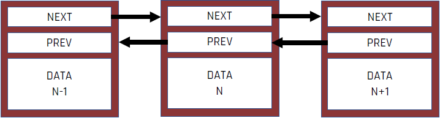

<!-- .slide: data-background="#111111" -->

# Multithreading

## Przykład: usuwanie węzła z listy dwukierunkowej

___

### Przykład: usuwanie węzła z listy dwukierunkowej

1. <!-- .element: class="fragment fade-in" --> Znajdź węzeł N do usunięcia
2. <!-- .element: class="fragment fade-in" --> Ustaw wskaźnik <code>NEXT</code> w węźle N-1 na N+1
3. <!-- .element: class="fragment fade-in" --> Ustaw wskaźnik <code>PREV</code> w węźle N+1 na N-1
4. <!-- .element: class="fragment fade-in" --> Usuń węzeł N

>Pomiędzy krokami 2 i 3 wskaźniki są ustawione w nieprawidłowy, niejednolity sposób

<!-- .element: class="fragment fade-in" -->

___
<!-- .slide: data-transition="fade-out" -->
#### Znajdź węzeł N do usunięcia

___
<!-- .slide: data-transition="fade" -->
#### Ustaw wskaźnik <code>NEXT</code> w węźle N-1 na N+1

___
<!-- .slide: data-transition="fade" -->
#### Ustaw wskaźnik <code>PREV</code> w węźle N+1 na N-1

___
<!-- .slide: data-transition="fade-in" -->
#### Usuń węzeł N

___

### Przykład: usuwanie węzła z listy dwukierunkowej

* <!-- .element: class="fragment fade-in" --> Usuwanie węzła z listy składa się z kilku kroków, następuje modyfikacja kilku węzłów
* <!-- .element: class="fragment fade-in" --> Co jeśli inny wątek będzie iterował po liście gdy trwa usuwanie węzła N?
* <!-- .element: class="fragment fade-in" --> Co jeśli inny wątek zacznie usuwać węzeł N+1 w czasie gdy trwa usuwanie węzła N?
* <!-- .element: class="fragment fade-in" --> Zjawisko to nosi nazwę wyścigów (race conditions)
* <!-- .element: class="fragment fade-in" --> Wyścigi zazwyczaj występują, gdy trzeba zmodyfikować dwa lub więcej oddzielnych kawałków danych, tak jak wskaźniki na przykładzie z listą