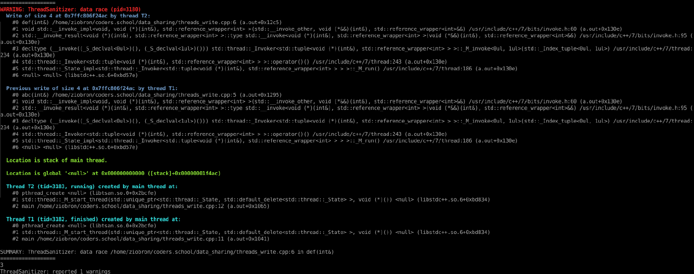

<!-- .slide: data-background="#111111" -->

# Multithreading

## Współdzielenie danych

### Thread sanitizer

<a href="https://coders.school">
    
</a>

___

### Thread sanitizer

```bash
$> g++ 01_threads_write.cpp -lpthread -fsanitize=thread -O2 -g
$> ./a.out
```
