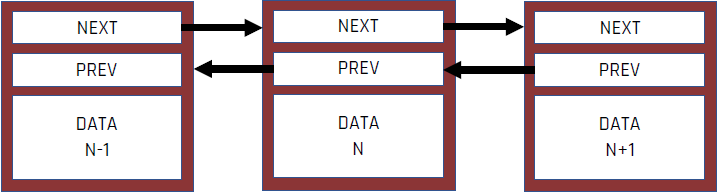
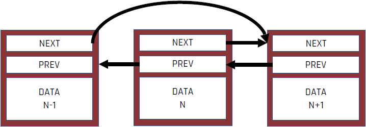
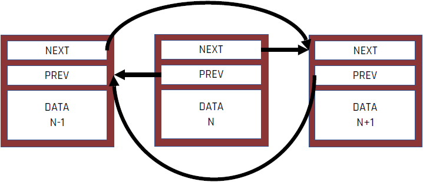
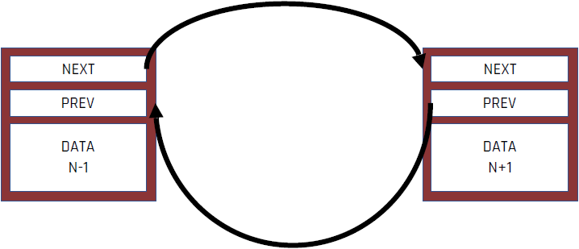

<!-- .slide: data-background="#111111" -->

# Data sharing

___

## Data sharing for reading

* <!-- .element: class="fragment fade-in" --> Imagine you are watching TV with your friends. Many friends can watch TV with you. Neither of you influences the material you are watching in any way (nobody has a remote :)).
* <!-- .element: class="fragment fade-in" --> It's exactly the same with sharing read-only data
  * <!-- .element: class="fragment fade-in" --> Threads = you and friends
  * <!-- .element: class="fragment fade-in" --> Data = movie
  * <!-- .element: class="fragment fade-in" --> Reading data by one thread does not interfere with reading data by another thread
* <!-- .element: class="fragment fade-in" --> No modification = no problems

___

## Data sharing with their modification

* <!-- .element: class="fragment fade-in" --> Imagine you are sharing an apartment with your roommates. Each of you has your own room, but the toilet is shared. When someone is in it, they have to lock the door. If you want to use the toilet at the same time, you can't do it. Waiting for a long time for another person to stop occupying the toilet is frustrating. After use, the toilet is in a different condition than before (less paper, used water, more interesting smells ...)
* <!-- .element: class="fragment fade-in" --> Exactly the same is with data sharing :)
  * <!-- .element: class="fragment fade-in" --> Threads = you and the roommate
  * <!-- .element: class="fragment fade-in" --> Resource (Data) = Toilet (Paper, Water)
  * <!-- .element: class="fragment fade-in" --> Mutex = door lock
* <!-- .element: class="fragment fade-in" --> Data modification (toilet use) = problem - synchronization required
* <!-- .element: class="fragment fade-in" --> What if there was no door with a lock to the toilet? Someone could drain the water during its use or pick up the last sheet of toilet paper.

___

## Example: removing a node from a bidirectional list

1. <!-- .element: class="fragment fade-in" --> Find the N node to be deleted
2. <!-- .element: class="fragment fade-in" --> Set the pointer <code>NEXT</code> at node N-1 to N + 1
3. <!-- .element: class="fragment fade-in" --> Set the pointer <code>PREV</code> at node N + 1 to N-1
4. <!-- .element: class="fragment fade-in" --> Delete node N

Between steps 2 and 3, the indicators are set incorrectly, not uniformly
<!-- .element: class="fragment fade-in" -->

___
<!-- .slide: data-transition="fade-out" -->
### Find the N node to be deleted

___
<!-- .slide: data-transition="fade" -->
### Set the pointer <code>NEXT</code> at node N-1 to N + 1

___
<!-- .slide: data-transition="fade" -->
### Set the pointer <code>PREV</code> at node N + 1 to N-1

___
<!-- .slide: data-transition="fade-in" -->
### Delete node N

___

## Example: removing a node from a bidirectional list

* <!-- .element: class="fragment fade-in" --> Removing a node from the list consists of several steps and modifying several nodes
* <!-- .element: class="fragment fade-in" --> What if another thread iterates through the list while removing the N node?
* <!-- .element: class="fragment fade-in" --> What if another thread starts removing node N + 1 while node N is being removed?
* <!-- .element: class="fragment fade-in" --> This phenomenon is called race conditions
* <!-- .element: class="fragment fade-in" --> Race conditions typically occur when two or more separate pieces of data need to be modified, such as the pointers in the list example

Data races are a slightly different phenomenon - they occur when two or more threads modify the same (one) memory area without synchronization
<!-- .element: class="fragment fade-in" -->
