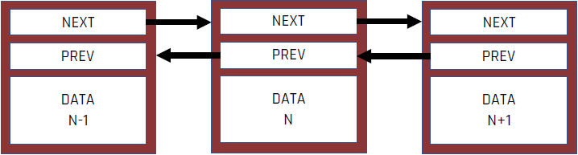
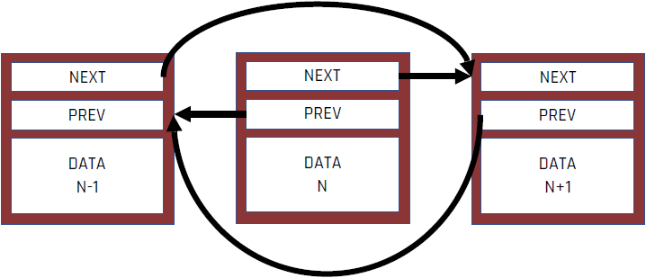

<!-- .slide: data-background="#111111" -->

# Współdzielenie danych

___

## Współdzielenie danych do odczytu

* <!-- .element: class="fragment fade-in" --> Wyobraź sobie, że oglądasz TV ze znajomymi. Wielu znajomych może oglądać TV razem z Tobą. Żadne z was nie wpływa w żaden sposób na oglądany materiał (nikt nie ma pilota :)).
* <!-- .element: class="fragment fade-in" --> Dokładnie tak samo jest ze współdzieleniem danych tylko do odczytu
  * <!-- .element: class="fragment fade-in" --> Wątki = Ty i znajomi
  * <!-- .element: class="fragment fade-in" --> Dane = film
  * <!-- .element: class="fragment fade-in" --> Odczyt danych przez jeden wątek nie zakłóca odczytu danych przez inny wątek
* <!-- .element: class="fragment fade-in" --> Brak modyfikacji = brak problemów

___

## Współdzielenie danych z ich modyfikacją

* <!-- .element: class="fragment fade-in" --> Wyobraź sobie, że współdzielisz mieszkanie ze współlokatorami. Każde z was ma własny pokój, ale toaleta jest wspólna. Gdy ktoś w niej jest, musi zablokować drzwi. Jeśli chcecie skorzystać z toalety w tym samym czasie nie możecie tego zrobić. Długie oczekiwanie, aż inna osoba przestanie okupować toaletę jest frustrujące. Toaleta po skorzystaniu jest w innym stanie niż przed (mniej papieru, zużyta woda, ciekawsze zapachy…)
* <!-- .element: class="fragment fade-in" --> Dokładnie tak samo jest ze współdzieleniem danych :)
  * <!-- .element: class="fragment fade-in" --> Wątki = Ty i współlokator
  * <!-- .element: class="fragment fade-in" --> Zasób (dane) = toaleta (papier, woda)
  * <!-- .element: class="fragment fade-in" --> Mutex = blokada drzwi
* <!-- .element: class="fragment fade-in" --> Modyfikacja danych (użycie toalety) = problem - wymagana jest synchronizacja
* <!-- .element: class="fragment fade-in" --> Co gdyby nie było drzwi z blokadą do toalety? Ktoś mógłby nam spuścić wodę w trakcie jej użytkowania albo podebrać ostatni listek papieru toaletowego.

___

## Przykład: usuwanie węzła z listy dwukierunkowej

1. <!-- .element: class="fragment fade-in" --> Znajdź węzeł N do usunięcia
2. <!-- .element: class="fragment fade-in" --> Ustaw wskaźnik <code>NEXT</code> w węźle N-1 na N+1
3. <!-- .element: class="fragment fade-in" --> Ustaw wskaźnik <code>PREV</code> w węźle N+1 na N-1
4. <!-- .element: class="fragment fade-in" --> Usuń węzeł N

Pomiędzy krokami 2 i 3 wskaźniki są ustawione w nieprawidłowy, niejednolity sposób
<!-- .element: class="fragment fade-in" -->

___
<!-- .slide: data-transition="fade-out" -->
### Znajdź węzeł N do usunięcia

___
<!-- .slide: data-transition="fade" -->
### Ustaw wskaźnik <code>NEXT</code> w węźle N-1 na N+1

___
<!-- .slide: data-transition="fade" -->
### Ustaw wskaźnik <code>PREV</code> w węźle N+1 na N-1

___
<!-- .slide: data-transition="fade-in" -->
### Usuń węzeł N

___

## Przykład: usuwanie węzła z listy dwukierunkowej

* <!-- .element: class="fragment fade-in" --> Usuwanie węzła z listy składa się z kilku kroków, następuje modyfikacja kilku węzłów
* <!-- .element: class="fragment fade-in" --> Co jeśli inny wątek będzie iterował po liście gdy trwa usuwanie węzła N?
* <!-- .element: class="fragment fade-in" --> Co jeśli inny wątek zacznie usuwać węzeł N+1 w czasie gdy trwa usuwanie węzła N?
* <!-- .element: class="fragment fade-in" --> Zjawisko to nosi nazwę wyścigów (race conditions)
* <!-- .element: class="fragment fade-in" --> Wyścigi (race conditions) zazwyczaj występują, gdy trzeba zmodyfikować dwa lub więcej oddzielnych kawałków danych, takich jak wskaźniki na przykładzie z listą

Wyścigi na danych (data race) są trochę innym zjawiskiem - występują gdy dwa lub więcej wątków modyfikuje ten sam (jeden) obszar pamięci bez synchronizacji
<!-- .element: class="fragment fade-in" -->
