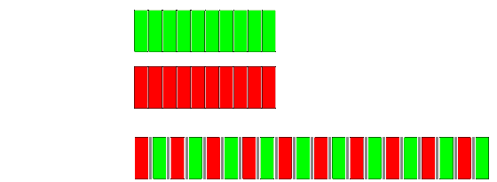

## Czym jest współbieżność?

* <!-- .element: class="fragment fade-in" --> Dwa procesy są współbieżne jeżeli jeden z nich rozpoczyna się przed zakończeniem drugiego.


* <!-- .element: class="fragment fade-in" --> Współbieżność polega na jednoczesnym wykonywaniu co najmniej dwóch czynności.

___

## Współbieżność w systemach komputerowych

* „Symulacja” współbieżności w systemach jednoprocesorowych przy wykorzystaniu mechanizmu przełączania zadań (ang. Task switching),
* Komputery/serwery wieloprocesorowe/wielordzeniowe obsługujące wiele aplikacji jednocześnie.



___

## Modele współbieżności

* Współbieżność z wieloma procesami:
  * Osobne procesy (komunikacja przez sygnały, pliki, potoki, gniazda itd.),
  * Osobna przestrzeń pamięci, bezpieczeństwo przetwarzania wielowątkowego,
  * Długi i skomplikowany proces uruchamiania nowego procesu.
* Współbieżność z wieloma wątkami:
  * Uruchamianie wielu wątków w obrębie jednego procesu, które współdzielą pamięć (współdzielona przestrzeń adresowa),
  * Należy samemu zagwarantować bezpieczeństwo dostępu do współdzielonej pamięci,
  * Uruchomienie wątku jest szybsze niż uruchomienie nowego procesu,
  * Prostsze i szybsze metody komunikowania się pomiędzy watkami w obrębie procesu

___

## Kiedy stosować współbieżność?

* Podział zagadnień (np. odtwarzacz Blu-ray),
* Wydajność:
  * Zrównoleglanie zadań (podział zadania na części),
  * Zrównoleglanie danych (wykonywanie tych samych zadań, na różnych fragmentach danych)

___

## Kiedy nie stosować współbieżności?

* Gdy zbyt wiele wątków może obniżyć wydajność zamiast ją zwiększyć (koszt uruchomienia wątku, koszt zasobów – każdy wątek zajmuje pamięć typowo 8MB.),
* Gdy wzrost wydajności nie jest proporcjonalny do włożonego wysiłku i złożoności kodu (koszt utrzymania kodu jest równie istotny).
<!-- Oryginalnie to brzmiało: Gdy wzrost wydajności nie jest proporcjonalny do woźnego wysiłku i złożoności kodu (koszt utrzymania kodu jest równie istotny)., zamieniłem "woźnego" na "włożonego", ale nie jestem pewien -->

___

## Proces oraz wątek

* Proces służy do organizowania wykonywania programu. W skład jednego programu wchodzi jeden lub więcej procesów. Zatem proces jest to cały kontekst niezbędny do wykonania programu.
* Zmianie w wyniku wykonywania procesu ulega między innymi segment danych, segment stosu, stan rejestrów procesora.
* W momencie wykonywania procesu system operacyjny przydziela procesowi niezbędne zasoby (pamięć, czas procesora itp.).
* Synchronizacja, sposób obsługi procesów itp. Kontrolowana jest przez system operacyjny.
* W obrębie każdego procesu istnieje jeden lub więcej wątków.
* Wątki tego samego procesu współdzielą większość przestrzeni adresowej (segment kodu i danych, otwarte pliki Itp.).
* Przełączanie kontekstu wątku jest stosunkowo szybki i nie obciążające system operacyjny.
* Tworzenie wątku wymaga mniej zasobów do działania i jest szybsze niż tworzenie procesu.
* Łatwa (ale również niebezpieczna) komunikacja pomiędzy wątkami w obrębie jednego procesu.
* Każdy wątek posiada odrębny stos (adres powrotu z funkcji oraz zmienne lokalne).

___

## C++ i obsługa wielowątkowości

* Standard C++11/14/17/20 – Wprowadzenie i rozwój bibliotek odpowiadających za obsługę wielowątkowości,
* Przed C++11 trzeba było korzystać z różnych bibliotek, lub ręcznie odwoływać się do interfejsów API udostępniających mechanizmy wielowątkowe,
* C++11 wprowadził również nowy model pamięci przystosowany do przetwarzania wielowątkowego na wielu platformach.
* Wprowadzono zarządzanie wątkami (ang. Thread), ochronę współdzielonych danych, synchronizacje operacji wykonywanych przez wątki, wykonywanie niskopoziomowych operacji atomowych itp.

___

## „Hello World”

```cpp
#include <iostream>
#include <thread>

void hello()
{
    std::cout << "Hello, world\n";
}

int main()
{
    std::thread t(hello);
    t.join();
}
```

___

## Zarządzanie wątkami

* std::thread,
* std::thread::join()
* std::thread::detach()
* std::thread::joinable()

```cpp
#include <iostream>
#include <thread>
#include <chrono>

void foo()
{
    std::this_thread::sleep_for(std::chrono::seconds(1));
}

int main()
{
    std::thread t;
    std::cout << "before starting, joinable: " << std::boolalpha << t.joinable() << '\n';

    t = std::thread(foo);
    std::cout << "after starting, joinable: " << t.joinable() << '\n';

    t.join();
    std::cout << "after joining, joinable: " << t.joinable() << '\n';
}
```

Output:

```output
before starting, joinable: false
after starting, joinable: true
after joining, joinable: false
```

___

## Co przekazać do std::thread?

* Funkcje
* Funktor (obiekt funkcyjny) – obiekt, który możemy wywołać tak jak funkcję (np. lambda)
* Wskaźnik na funkcje lub wskaźnik do funkcji składowej
* Obiekt funkcyjny jest <strong>kopiowany</strong> do obszaru pamięci należącej do nowo utworzonego wątku

___

## Co przekazać do std::thread?

```cpp
struct Bar {
    void operator()()
    {
        std::cout << "Hello world";
    }
}

void foo()
{
    std::cout << "Hello world";
}

int main()
{
    std::thread t1([]() {
        "Hello world"
    });

    std::thread t2(foo);

    Bar bar;
    std::thread t3(bar);
}
```

```cpp
void foo()
{
    std::cout << "Hello world\n";
}

class Bar {
public:
    void foo()
    {
        std::cout << "Hello world\n";
    };
};

int main()
{
    std::thread t(*foo);
    t.join();

    class Bar bar;
    std::thread t1(&Bar::foo, bar);
    t1.join();

    return 0;
}
```

___

## std::thread::detach()

* Zadanie 1:
  * Jakie zagrożenia kryje kod poniżej?
  * Jak go poprawić?

```cpp
#include <iostream>
#include <thread>

void do_something(int data)
{
    std::cout << "Data: " << data << "\n" << std::flush;
}

struct Foo {
public:
    Foo(int& i): i_(i) {}
    void operator()()
    {
        for (int k = 0; k < 100000 ; ++k) {
            do_something(++i_);
        }
    }

private:
    int& _i;
};

void oops()
{
    int some_local_state = 0;
    Foo foo(some_local_state);
    std::thread t(foo);
    std::cout << "Detach thread\n" << std::flush;
    t.detach();
}

int main()
{
    std::thread t(oops);
    t.join();

    return 0;
}
```

___

## `std::terminate` i `std::thread::~thread`

* If <code>*this</code> has an associated thread (<code>joinable() == true</code>), <a href=https://en.cppreference.com/w/cpp/error/terminate>std::terminate()</a> is called.
* <strong>ZAWSZE</strong> należy zawołać <code>std::join()</code> lub <code>std::detach()</code> na wątku!
* Co z wyjątkami, jakieś pomysły?

___

## `std::exception`

* Zadanie 2:
  * Jakie zagrożenia kryje kod poniżej?
  * Jak lepiej można rozwiązać poniższy problem?

```cpp
void do_something(int data)
{
    std::cout << "Data: " << data << "\n" << std::flush;
}

struct Foo {
public:
    Foo(int& i): i_(i) {}
    void operator()()
    {
        for (int k = 0; k < 10 ; ++k) {
            do_something(++i_);
        }
    }

private:
    int& _i;
};

void bar() {throw std::runtime_error("Error"); }

void oops()
{
    int some_local_state = 0;
    Foo foo(some_local_state);
    std::thread t(foo);
    try {
        bar();
    } catch (...) {
        std::cout << "ERROR" << std::endl;
        t.join();
        throw;
    }
    t.detach();
}

int main()
{
    oops();
    return 0;
}
```

___

## RAII (Resource Acquisition Is Initialization)

* Własna Klasa ThreadGuard – zapewniająca bezpieczeństwo złączania wątków

```cpp
class ThreadGuard {
    std::thread& t;
public:
    explicit ThreadGuard(std::thread& t_) :
        t(t_)
    {}
    ~ThreadGuard()
    {
        if (t.joinable()) {
            t.join();
        }
    }
    ThreadGuard(ThreadGuard const&) = delete;
    ThreadGuard& operator=(ThreadGuard&) = delete;
};
struct func;

void f()
{
    int local = 0;
    Fun fun(local);
    std::thread t(fun);
    ThreadGuard g(t); // lub ThreadGuard(std::thread(fun))
    foo();
}
```

___

## Przekazywanie argumentów do funkcji wątku

* Przekazywanie przez wartość

```cpp
struct SomeStruct {

};

void bar(int x, std::string str, SomeStruct obj)
{

}

int main()
{
    std::thread t(bar, 10, "String", SomeStruct{});
    t.join();
}
```

___

## Przekazywanie argumentów do funkcji wątku

* Przekazywanie przez wskaźnik, referencję

```cpp
void bar(int& x, int* y)
{
    std::cout << "Inside fun: x = " << x << " | y = " << *y << std::endl;
    x = 20;
    *y = 30;
}

int main()
{
    int x = 10;
    int y = 10;
    std::thread t(bar, std::ref(x), &y);
    t.join();
    std::cout << "Outside fun: x = " << x << " | y = " << y << std::endl;

    return 0;
}
```

___

## Pułapki podczas przekazywania argumentów

* Zadanie 3: Jakie pułapki kryje kod poniżej?

```cpp
void f(int i, std::string const& s);
void oops(int arg)
{
    char buffer[1024];
    sprintf(buffer, "%i", arg);
    std::thread t(f, 3, buffer);
    t.detach();
}
```

___

## Pułapki podczas przekazywania argumentów

* Należy zwrócić uwagę na przekazywane argumenty
  * Jeżeli zmienna jest wskaźnikiem/referencją, należy zadbać aby długość jej życia była dłuższa niż wątku, który na niej operuje.
  * Jeżeli istnieje ryzyko niejawnej konwersji, najlepiej od razu przekazać przekonwertowany argument.

```cpp
void f(int i, std::string const& s);
void not_oops(int arg)
{
    char buffer[1024];
    sprintf(buffer, "%i", arg);
    std::thread t(f, 3, std::string(buffer));
    t.detach();
}
```

___

## Przenoszenie wątków

* Tak jak np. <code>std::unique_ptr</code>, wątki mogą być jedynie przenoszone (ich kopiowanie nie miało by sensu, gdyż 2 obiekty zarządzałyby jednym wątkiem)
* Do przenoszenia wątków wykorzystujemy bibliotekę utility i funkcję <code>std::move</code>

```cpp
int main()
{
    std::thread t1;
    std::thread t2(foo);
    std::thread t3(std::move(t2));
    t1 = std::thread(bar);

    std::cout << std::boolalpha << "t1: " << t1.joinable() << std::endl;
    std::cout << std::boolalpha << "t2: " << t2.joinable() << std::endl;
    std::cout << std::boolalpha << "t3: " << t3.joinable() << std::endl;

    return 0;
}
```

___

## Wybór liczby wątków podczas implementacji

* Zbyt dużo wątków – program działa wolniej,
* Zbyt mało wątków – brak wykorzystania potencjału,
* <code>std::thread::hardware_concurrency()</code>

___

## Identyfikacja wątków

* <code>std::this_thread::get_id()</code>
* <code>std::thread::id()</code>
* Można porównywać id, można je wyświetlać poprzez <code>std::cout</code>
* Możemy wykorzystać je do identyfikacji poszczególnych wątków

```cpp
std::thread::id master_thread;
void some_core_part_of_the_algorithm()
{
    if (std::this_thread::get_id() == master_thread) {
        do_master_thread_work();
    }
    do_common_work();
}
```

___

## Usypianie wątków

* <code>std::this_thread::sleep_until</code>
* <code>std::this_thread::sleep_for</code>
* <code>std::chrono</code>
* <code>std::chrono_literals</code>

```cpp
#include <iostream>
#include <chrono>
#include <thread>

int main()
{
    using namespace std::chrono_literals;
    std::cout << "Hello waiter\n" << std::flush;
    auto start = std::chrono::high_resolution_clock::now();
    std::this_thread::sleep_for(2s);
    auto end = std::chrono::high_resolution_clock::now();
    std::chrono::duration<double, std::milli> elapsed = end - start;
    std::cout << "Waited " << elapsed.count() << " ms\n";
}
```

Possible output:

```output
Hello waiter
Waited 2000.12 ms
```

___

## Zadanie 4

* Zaimplementuj program w którym 4 wątki będą wyświetlać swój <code>std::this_thread::id()</code> określoną liczbę razy

```cpp
#include <iostream>
#include <thread>
#include <chrono>

using namespace std::chrono_literals;

template <typename TIME>
void daemon(int number, TIME time)
{
    for (int i = 0 ; i < number; ++i) {
        std::cout << "Hi I'm thread with id: " << std::this_thread::get_id() << " Number: " << number << std::endl;
        std::this_thread::sleep_for(time);
    }
}

int main()
{
    std::thread t1(daemon<decltype(1s)>, 20, 1s);
    std::thread t2(daemon<decltype(1500ms)>, 15, 1500ms);
    std::thread t3(daemon<decltype(2700ms)>, 10, 2700ms);

    t1.detach();
    t2.detach();
    t3.detach();

    daemon(4, 7s);
    return 0;
}
```

___

## Zadanie 5

* Zaimplementuj algorytm <code>std::accumulate</code> wykorzystując wielowątkowość

```cpp
template< class InputIt, class T>
T accumulate( InputIt first, InputIt last, T init);
```

```cpp
template<class InputIt, class T>
constexpr // since C++20
T accumulate(InputIt first, InputIt last, T init)
{
    for (; first != last; ++first) {
        init = std::move(init) + *first; // std::move since C++20
    }
    return init;
}
```

___

## Wskazówka 1

* Obliczenie wymaganych wątków
* Stworzenie kontenera przechowującego wyniki

```cpp
const size_t hardwareThread = std::thread::hardware_concurrency();
const size_t neededThreads = std::min(size / minimumSize, hardwareThread);
const size_t chunkSize = size / neededThreads;

std::cout << "NeededThreads: " << neededThreads << std::endl;
std::cout << "ChunkSize: " << chunkSize << std::endl;
std::vector<std::thread> threads(neededThreads - 1);
std::vector<T> results(neededThreads);
```

___

## Wskazówka 2

* Implementacja funktora dla wątków
  * Funktor przyjmuje kolejne porcje danych
  * Należy obliczyć i przekazać mu iteratory odnoszące się do początku i końca zakresu na którym ma operować wątek.
  * Należy przekazać także przez referencje zmienną przechowującą wynik.

```cpp
std::thread([](IT first, IT last, T& result)
            {
                result = std::accumulate(first, last, T{});
            }, begin, end, std::ref(results[i]));
```

___

## Wskazówka 3

* Należy wykorzystać również aktualny wątek, na którym wywoływana jest funkcja, aby nie czekał bezczynnie na wywołanie pozostałych wątków

```cpp
auto begin = first;
for (size_t i = 0; i < neededThreads - 1; ++i) {
    auto end = std::next(begin, chunkSize);
    threads[i] = std::thread([](IT first, IT last, T& result)
            {
                result = std::accumulate(first, last, T{});
            }, begin, end, std::ref(results[i]));
    begin = end;
}
results[neededThreads - 1] = std::accumulate(begin, last, T{});
```

___

## Czy zadanie było trudne?

* Co sprawiło największy problem?
* Czy można uprościć algorytm?
* Czy można zastosować inne mechanizmy ułatwiające implementacje?

___

## Zadanie domowe

* Zaimplementuj algorytm <code>count_if</code> wykorzystując wielowątkowość

#### POWODZENIA 🙂
