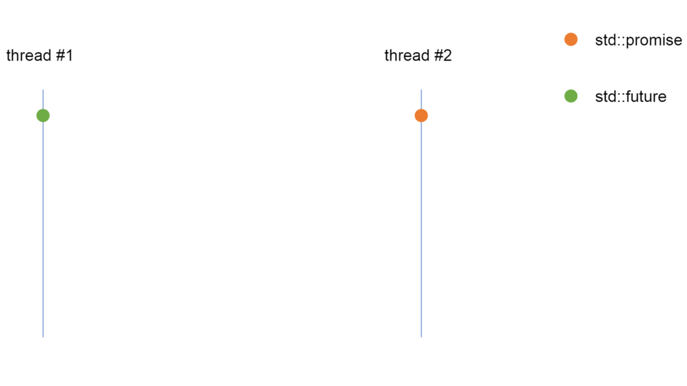

<!-- .slide: data-background="#111111" -->

# Multithreading

## `std::promise`/`std::future` in C++

### Jak działa `std::promise`/`std::future`

<a href="https://coders.school">
    
</a>

___

### Jak działa `std::promise`/`std::future`



___

### Podstawy użycia `std::promise`/`std::future`

<div style="display:flex;">

<div style="width: 59%;">

```c++
std::promise<int> promise;
std::future<int> future = promise.get_future();
auto function = [] (std::promise<int> promise) {
    // ...
    promise.set_value(10);
};
std::thread t(function, std::move(promise));
std::cout << future.get() << std::endl;
t.join();
```
<!-- .element: class="fragment fade-in" -->
</div>
<div style="width: 41%;">

* <!-- .element: class="fragment fade-in" --> <code>std::promise</code>/<code>std::future</code> używane są, by stworzyć <span style="color:#AD5758;">jednokierunkowy kanał komunikacji</span>
* <!-- .element: class="fragment fade-in" --> <code>std::promise</code> ma za zadanie <span style="color:#AD5758;">ustawić wartość</span>
* <!-- .element: class="fragment fade-in" --> Zadaniem <code>std::future</code> natomiast, jest <span style="color:#AD5758;">pozyskanie wartości</span>
</div>

</div>

<div style="background-color: #8B3536; padding: 3px 22px;">

<code>std::promise</code>/<code>std::future</code> mogą być użyte jednorazowo

</div> <!-- .element: class="fragment fade-in" -->