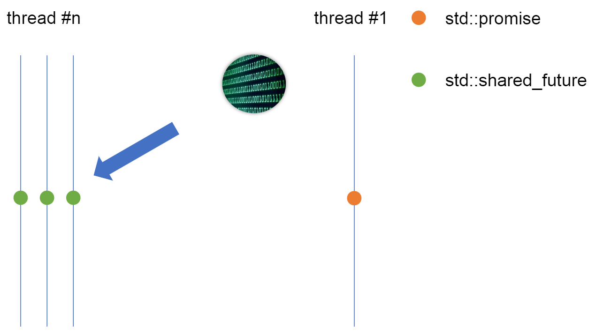

<!-- .slide: data-background="#111111" -->

# Multithreading

## `std::promise`/`std::future` in C++

### One-to-many connection

<a href="https://coders.school">
    
</a>

___

### One-to-many connection



___

### One-to-many connection

```c++
std::shared_future<int> sfuture = promise.get_future().share();
```
<!-- .element: class="fragment fade-in" -->
* <!-- .element: class="fragment fade-in" --> allows multiple <span style="color:#cf802a;">getting</span>
* <!-- .element: class="fragment fade-in" --> <span style="color:#cf802a;">copyable</span> and <span style="color:#cf802a;">movable</span>
* <!-- .element: class="fragment fade-in" --> each thread should have its <span style="color:#cf802a;">own</span> shared_future object

<div style="background-color: #8B3536; padding: 3px 22px;">

<code>std::shared_promise</code> does not exist

</div> <!-- .element: class="fragment fade-in" -->