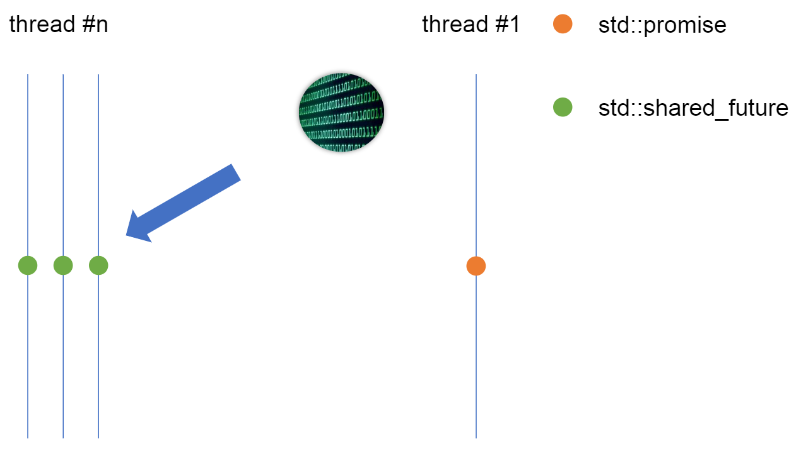

<!-- .slide: data-background="#111111" -->

# Multithreading

## `std::promise`/`std::future` in C++

### Połączenie "jeden do wielu"

<a href="https://coders.school">
    
</a>

___

### Połączenie "jeden do wielu"



___

### Połączenie "jeden do wielu"

```c++
std::shared_future<int> sfuture = promise.get_future().share();
```
<!-- .element: class="fragment fade-in" -->
* <!-- .element: class="fragment fade-in" --> umożliwia wielokrotne <span style="color:#cf802a;">pozyskiwanie wartości</span>
* <!-- .element: class="fragment fade-in" --> pozwala na <span style="color:#cf802a;">kopiowanie</span> i <span style="color:#cf802a;">przenoszenie</span>
* <!-- .element: class="fragment fade-in" --> każdy wątek powinien mieć <span style="color:#cf802a;">własny</span> obiekt <code>shared_future</code>

<div style="background-color: #8B3536; padding: 3px 22px;">

<code>std::shared_promise</code> nie istnieje

</div> <!-- .element: class="fragment fade-in" -->