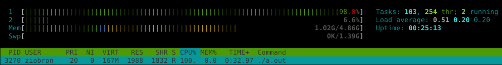

<!-- .slide: data-background="#111111" -->

# Thread-safe queue

<a href="https://coders.school">
    
</a>

___

## Exercise: FIFO queue

<div class="multicolumn">

<div style="width: 50%; font-size: .9em;">

```cpp []
template <typename T>
class ThreadsafeQueue {
    deque<T> queue_;
    // TODO: Make it thread-safe

public:
    void push(const T & element) {
        queue_.push_front(element);
    }
    T pop() {
        auto top = queue_.back();
        queue_.pop_back();
        return top;
    }
    bool empty() const {
        return queue_.empty();
    }
};

```
<!-- .element: class="fragment fade-in" -->
</div>

<div style="width: 40%; padding: 20px; font-size: .9em;">

* <!-- .element: class="fragment fade-in" --> In <code>exercises/01_threadsafe_queue.cpp</code> there is a FIFO queue implementation
* <!-- .element: class="fragment fade-in" --> Fix the <code>textProducer</code> thread to generate correct strings:
  * <!-- .element: class="fragment fade-in" --> This is random text number 0
  * <!-- .element: class="fragment fade-in" --> This is random text number 1
  * <!-- .element: class="fragment fade-in" --> …
  * <!-- .element: class="fragment fade-in" --> This is random text number n
* <!-- .element: class="fragment fade-in" --> Prevent queue operations from being accessed by multiple threads at the same time (make it thread-safe 🙂)
* <!-- .element: class="fragment fade-in" --> What kind of problem can you see?

</div>

</div>

___
<!-- .slide: data-auto-animate -->

## produceText - problem
<!-- .element: data-id="title" -->

```cpp []
void produceText(StringQueue & sq, int number) {
    for (int i = 0; i < number; i++)
        sq.push("This is random text number " + i);
}
```
<!-- .element: data-id="box" -->

___
<!-- .slide: data-auto-animate -->

## produceText - solution
<!-- .element: data-id="title" -->

```cpp []
void produceText(StringQueue & sq, int number) {
    for (int i = 0; i < number; i++)
        sq.push("This is random text number " + to_string(i));
}

```
<!-- .element: data-id="box" -->

___
<!-- .slide: style="font-size: .9em" -->

## Solution: thread-safe queue

```cpp []
template <typename T>
class ThreadsafeQueue {
    deque<T> queue_;
    mutable mutex m_;
    using Lock = lock_guard<mutex>;

public:
    void push(const T & element) {
        Lock l(m_);
        queue_.push_front(element);
    }
    T pop() {
        Lock l(m_);
        auto top = queue_.back();
        queue_.pop_back();
        return top;
    }
    bool empty() const {
        Lock l(m_);
        return queue_.empty();
    }
};

```
<!-- .element: class="fragment fade-in" -->

___
<!-- .slide: data-background="img/efekt_cieplarniany.jpg" data-background-opacity="0.5" -->
## Problem

### CPU heating

### the greenhouse effect

___

## Spinlock

```cpp []
void saveToFile(StringQueue & sq) {
    ofstream file("/tmp/sth.txt");
    while (file) {
        while (sq.empty()) { /* nop */ }
        file << sq.pop() << endl;
    }
}
```
<!-- .element: class="fragment fade-in" -->

* <!-- .element: class="fragment fade-in" --> Spinlock is a state in which the thread is repeatedly checking if a certain condition has been met
* <!-- .element: class="fragment fade-in" --> Another name for this problem is "busy waiting"
* <!-- .element: class="fragment fade-in" --> The problem can be solved by the condition variable


<!-- .element: class="fragment fade-in" -->
