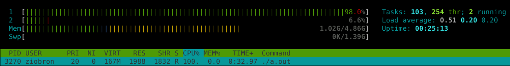

<!-- .slide: data-background="#111111" -->

# Aktywne czekanie

<a href="https://coders.school">
    
</a>

___

## Zadanie: kolejka FIFO

<div style="display: flex;">

<div style="width: 60%; font-size: .9em;">

```cpp []
template <typename T>
class ThreadsafeQueue {
    deque<T> queue_;
    // TODO: Make it thread-safe :)

public:
    void push(const T & element) {
        queue_.push_front(element);
    }
    T pop() {
        auto top = queue_.back();
        queue_.pop_back();
        return top;
    }
    bool empty() const {
        return queue_.empty();
    }
};

```
<!-- .element: class="fragment fade-in" -->
</div>

<div style="width: 40%; padding: 20px; font-size: .9em;">

* <!-- .element: class="fragment fade-in" --> W pliku <code>01_threadsafe_queue.cpp</code> znajduje się wybrakowana implementacja kolejki FIFO
* <!-- .element: class="fragment fade-in" --> Napraw wątek <code>textProducer</code>, aby generował prawidłowe napisy:
  * <!-- .element: class="fragment fade-in" --> This is random text number 0
  * <!-- .element: class="fragment fade-in" --> This is random text number 1
  * <!-- .element: class="fragment fade-in" --> …
  * <!-- .element: class="fragment fade-in" --> This is random text number n
* <!-- .element: class="fragment fade-in" --> Zabezpiecz operacje na kolejce przed dostępem z wielu wątków (make it thread-safe 🙂)
* <!-- .element: class="fragment fade-in" --> Jaki problem widzisz?

</div>

</div>

___

## Zadanie – rozwiązanie: naprawione wyświetlanie tekstu

```cpp []
void produceText(StringQueue & sq, int number) {
    for (int i = 0; i < number; i++)
        sq.push("This is random text number "
                + i);
}

void produceText(StringQueue & sq, int number) {
    for (int i = 0; i < number; i++)
        sq.push("This is random text number " +
                to_string(i));
}

```
<!-- .element: class="fragment fade-in" -->

___
<!-- .slide: style="font-size: .9em" -->

## Zadanie – rozwiązanie: threadsafe queue

```cpp []
template <typename T>
class ThreadsafeQueue {
    deque<T> queue_;
    mutable mutex m_;
    using Lock = lock_guard<mutex>;

public:
    void push(const T & element) {
        Lock l(m_);
        queue_.push_front(element);
    }
    T pop() {
        Lock l(m_);
        auto top = queue_.back();
        queue_.pop_back();
        return top;
    }
    bool empty() const {
        Lock l(m_);
        return queue_.empty();
    }
};

```
<!-- .element: class="fragment fade-in" -->

___

## Problem – grzanie CPU i efekt cieplarniany


___

## Aktywne czekanie

```cpp []
void saveToFile(StringQueue & sq) {
    ofstream file("/tmp/sth.txt");
    while (file) {
        while (sq.empty()) { /* nop */ }
        file << sq.pop() << endl;
    }
}
```
<!-- .element: class="fragment fade-in" -->

* <!-- .element: class="fragment fade-in" --> Aktywne czekanie (busy waiting) to stan, w którym wątek ciągle sprawdza, czy został spełniony pewien warunek
* <!-- .element: class="fragment fade-in" --> Inna nazwa tego problemu to wirująca blokada (spinlock)
* <!-- .element: class="fragment fade-in" --> Problem rozwiązuje zmienna warunku (condition variable)


<!-- .element: class="fragment fade-in" -->
