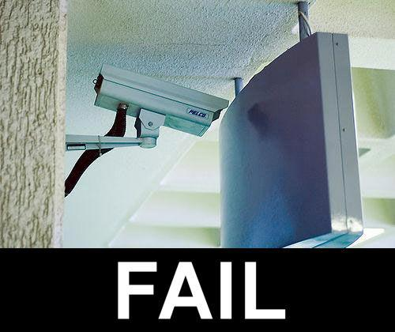

<!-- .slide: data-background="#111111" -->

# Multithreading

## Moduł 4

### Zapętlony wątek

<a href="https://coders.school">
    
</a>

___
<!-- .slide: style="font-size: .85em" -->

### Przykład: jak zatrzymać zapętlony wątek?

<div style="display: flex;">

<div style="width: 70%;">

```c++
#include <thread>
using namespace std;

int main() {
    bool stop = false;
    auto f = [&] {
        while (not stop) {
            /* do sth... */
        }
    };
    thread t(f);
    stop = true;
    t.join();
    return 0;
}
```
<!-- .element: class="fragment fade-in" -->

```bash
$> g++ 01_stop.cpp -lpthread -fsanitize=thread
$> ./a.out
WARNING: ThreadSanitizer: data race (pid=10179)
...
$> g++ 01_stop.cpp -lpthread -fsanitize=thread -03
$> ./a.out
deadlock
```
<!-- .element: class="fragment fade-in" -->

</div>

<div>


<!-- .element: class="fragment fade-in" -->

</div>

</div>

___

### Przykład: jak zatrzymać zapętlony wątek?

* <!-- .element: class="fragment fade-in" --> Zapis wykonywany w kilku krokach
* <!-- .element: class="fragment fade-in" --> Optymalizacje kompilatora
* <!-- .element: class="fragment fade-in" --> Optymalizacje w procesorze (cache)
* <!-- .element: class="fragment fade-in" --> Są wyścigi
* <!-- .element: class="fragment fade-in" --> Możliwe zakleszczenie
* <!-- .element: class="fragment fade-in" --> Jak zrobić to lepiej?

___
<!-- .slide: style="font-size: .85em" -->

### Przykład: jak zatrzymać zapętlony wątek – volatile?

<div style="display: flex;">

<div style="width: 70%;">

```c++
#include <thread>
using namespace std;

int main() {
    volatile bool stop = false;
    auto f = [&] {
        while (not stop) {
            /* do sth... */
        }
    };
    thread t(f);
    stop = true;
    t.join();
    return 0;
}
```
<!-- .element: class="fragment fade-in" -->

```bash
$> g++ 01b_volatile.cpp -lpthread -fsanitize=thread
$> ./a.out
WARNING: ThreadSanitizer: data race (pid=10179)
...
$> g++ 01b_volatile.cpp -lpthread -fsanitize=thread -03
$> ./a.out
WARNING: ThreadSanitizer: data race (pid=10179)
...
```
<!-- .element: class="fragment fade-in" -->

</div>

<div>


<!-- .element: class="fragment fade-in" -->

</div>

</div>

___

### Przykład: jak zatrzymać zapętlony wątek – volatile?

* <!-- .element: class="fragment fade-in" --> Zapis wykonywany w kilku krokach
* <!-- .element: class="fragment fade-in" --> <strike>Optymalizacje kompilatora</strike>
* <!-- .element: class="fragment fade-in" --> Optymalizacje w procesorze (cache)
* <!-- .element: class="fragment fade-in" --> Są wyścigi
* <!-- .element: class="fragment fade-in" --> Jest niezdefiniowane zachowanie
* <!-- .element: class="fragment fade-in" --> Iluzja poprawności
* <!-- .element: class="fragment fade-in" --> volatile == may be modified by external agents
* <!-- .element: class="fragment fade-in" --> volatile != may be modified concurrently by the program
* <!-- .element: class="fragment fade-in" --> Jak zrobić to lepiej?

___
<!-- .slide: style="font-size: .95em" -->

### Przykład: jak zatrzymać zapętlony wątek – zmienna z mutexem?

<div style="display: flex;">

<div style="width: 50%;">

```c++
#include <thread>
#include <mutex>

using namespace std;

int main() {
    bool flag = false;
    mutex m;

    auto stop = [&] {
        lock_guard<mutex> lg(m);
        return flag;
    };
```
<!-- .element: class="fragment fade-in" -->

</div>

<div style="width: 50%;">

```c++
    auto f = [&] {
        while (not stop()) {
            /* do sth... */
        }
    };
    thread t(f);
    {
        lock_guard<mutex> lg(m);
        flag = true;
    }
    t.join();
    return 0;
}
```
<!-- .element: class="fragment fade-in" -->

</div>

</div>

```bash
$> g++ 01c_mutex.cpp -lpthread -fsanitize=thread
$> ./a.out
$> g++ 01c_mutex.cpp -lpthread -fsanitize=thread -03
$> ./a.out
```
<!-- .element: class="fragment fade-in" -->

___

### Przykład: jak zatrzymać zapętlony wątek – zmienna z mutexem?

* <!-- .element: class="fragment fade-in" --> Poprawne!
* <!-- .element: class="fragment fade-in" --> Długi kod…
* <!-- .element: class="fragment fade-in" --> Wolne…

<div>


<!-- .element: class="fragment fade-in" -->

</div>

___
<!-- .slide: style="font-size: .95em" -->

### Przykład: jak zatrzymać zapętlony wątek – zmienna atomowa

```c++
#include <thread>
#include <atomic>
using namespace std;

int main() {
    atomic<bool> stop{false};
    auto f = [&] {
        while (not stop) {
            /* do sth... */
        }
    };
    thread t(f);
    stop = true;
    t.join();
    return 0;
}
```
<!-- .element: class="fragment fade-in" -->

```bash
$> g++ 01d_atomic.cpp -lpthread -fsanitize=thread -03
$> ./a.out
```
<!-- .element: class="fragment fade-in" -->

___

### Przykład: jak zatrzymać zapętlony wątek – zmienna atomowa

* <!-- .element: class="fragment fade-in" --> Poprawne!
* <!-- .element: class="fragment fade-in" --> Lekkie
* <!-- .element: class="fragment fade-in" --> Mało kodu

<div>


<!-- .element: class="fragment fade-in" -->

</div>
