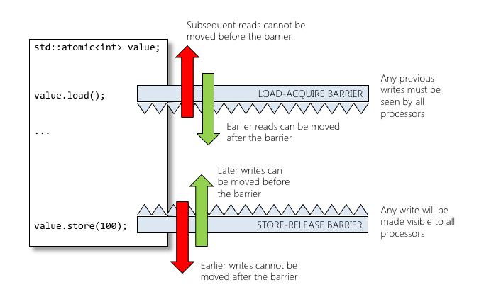

<!-- .slide: data-background="#111111" -->

# `std::memory_order`

<a href="https://coders.school">
    
</a>

___

## Normal variables vs Atomic variables

Normal variables
<!-- .element: class="fragment fade-in" -->

* <!-- .element: class="fragment fade-in" --> simultaneous write and read == undefined behavior
* <!-- .element: class="fragment fade-in" --> need to block with mutexes in case of modification

Atomic variables
<!-- .element: class="fragment fade-in" -->

* <!-- .element: class="fragment fade-in" --> simultaneous write and read == defined behavior
* <!-- .element: class="fragment fade-in" --> no additional locking mechanisms required

___

## Atomic variables

* <!-- .element: class="fragment fade-in" --> <code>#include &lt;atomic&gt;</code>
* <!-- .element: class="fragment fade-in" --> <code>std::atomic</code>
* <!-- .element: class="fragment fade-in" --> Light synchronization
* <!-- .element: class="fragment fade-in" --> Allows simple arithmetic and bitwise operations: ++, --, +=, -=, &=, |=, ^=
* <!-- .element: class="fragment fade-in" --> Typically: numbers, pointers
* <!-- .element: class="fragment fade-in" --> The most important operations:
  * <!-- .element: class="fragment fade-in" --> <code>store()</code> - saves the value in an atomic variable, you can also specify <code>std::memory_order</code>
  * <!-- .element: class="fragment fade-in" --> <code>operator=()</code> - saves the value in an atomic variable
  * <!-- .element: class="fragment fade-in" --> <code>load()</code> - reads the value from an atomic variable, you can also specify <code>std::memory_order</code>
  * <!-- .element: class="fragment fade-in" --> <code>operator T()</code> - reads the value from an atomic variable

___

## `std::memory_order`

* <!-- .element: class="fragment fade-in" --> As part of optimization, the compiler has the right to change the order of operations
* <!-- .element: class="fragment fade-in" --> The compiler needs to know which operations can be rearranged and which must follow a certain order
* <!-- .element: class="fragment fade-in" --> SC - Sequential consistency (<code>memory_order_seq_cst</code>) ensures that the order of operations set by the developer is preserved, sometimes at the expense of performance. This is the default behavior of <code>std::atomic</code> variables
* <!-- .element: class="fragment fade-in" --> Thanks to SC, we can correctly conclude what values may variables have regardless of the processor optimization
  * <!-- .element: class="fragment fade-in" --> Compiler optimizations cannot create race conditions
  * <!-- .element: class="fragment fade-in" --> Boring Details: <a href="https://en.cppreference.com/w/cpp/atomic/memory_order">memory_order on cppreference.com</a>

___
<!-- .slide: style="font-size: .95em" -->

## Sequential consistency and optimizations

<div style="display: flex;">

<div style="width: 33%; font-size: .9em;">

```cpp []
// INPUT:
int foo(int a)
{
    if(a<1)
        b=2;
    if(a==2)
        b=2;
    if(a>2)
        b=2;
    return b;
}


```
<!-- .element: class="fragment fade-in" -->
</div>

<div style="width: 33%; font-size: .9em;">

```cpp []
// OPT1:
int foo(int a)
{
    if(a>2)
        b=2;
    else
        if(a<1)
            b=2;
        else
            if(a==2)
                b=2;
    return b;
}
```
<!-- .element: class="fragment fade-in" -->
</div>

<div style="width: 33%; font-size: .9em;">

```cpp []
// OPT2:
int foo(int a)
{
    const int tmp=b;
    b=2;
    if(a==1)
        b=tmp;
    return b;
}


```
<!-- .element: class="fragment fade-in" -->
</div>

</div>

### Are OPT1 and OPT2 correct?
<!-- .element: class="fragment fade-in" -->

* <!-- .element: class="fragment fade-in" --> Only OPT1
* <!-- .element: class="fragment fade-in" --> In OPT2, state b has changed regardless of the value of a
* <!-- .element: class="fragment fade-in" --> Another thread may have read b value at this time

___

## `std::memory_order` values

* <!-- .element: class="fragment fade-in" --> <code>memory_order_relaxed</code>
* <!-- .element: class="fragment fade-in" --> <code>memory_order_consume</code>
* <!-- .element: class="fragment fade-in" --> <code>memory_order_acquire</code>
* <!-- .element: class="fragment fade-in" --> <code>memory_order_release</code>
* <!-- .element: class="fragment fade-in" --> <code>memory_order_acq_rel</code>
* <!-- .element: class="fragment fade-in" --> <code>memory_order_seq_cst</code>

___
<!-- .slide: style="font-size: .9em" data-auto-animate -->
## `memory_order_relaxed`

* <!-- .element: class="fragment fade-in" --> No synchronization or ordering constraints imposed on other reads or writes
* <!-- .element: class="fragment fade-in" --> Only this operation's atomicity is guaranteed (read or write)

```cpp []
int main() {
    int x{}, y{}, r1{}, r2{};

    std::thread t1{[&] {
        r1 = y.load(std::memory_order_relaxed); // A
        x.store(r1, std::memory_order_relaxed); // B
    }};
    std::thread t2{[&] {
        r2 = x.load(std::memory_order_relaxed); // C
        y.store(42, std::memory_order_relaxed); // D
    }};
    t1.join();
    t2.join();
    std::cout << r1 << ' ' << r2 << '\n';
}
```
<!-- .element: class="fragment fade-in" data-id="relaxed-code" -->

### Possible results?
<!-- .element: class="fragment fade-in" data-id="results" -->

___
<!-- .slide: style="font-size: .9em" data-auto-animate -->

## `memory_order_relaxed`

```cpp
std::thread t1{[&] {
    r1 = y.load(std::memory_order_relaxed); // A
    x.store(r1, std::memory_order_relaxed); // B
}};
std::thread t2{[&] {
    r2 = x.load(std::memory_order_relaxed); // C
    y.store(42, std::memory_order_relaxed); // D
}};
```
<!-- .element: data-id="relaxed-code" -->

### Possible results
<!-- .element: data-id="results" -->

* <!-- .element: class="fragment fade-in" --> <code>r1 = 0, r2 = 0</code>
  * <!-- .element: class="fragment fade-in" --> orders of execution: ABCD, ACBD, ACDB, CADB, CABD
* <!-- .element: class="fragment fade-in" --> <code>r1 = 42, r2 = 0</code>
  * <!-- .element: class="fragment fade-in" --> orders of execution: CDAB
* <!-- .element: class="fragment fade-in" --> <code>r1 = 42, r2 = 42</code>
  * <!-- .element: class="fragment fade-in" --> orders of execution: DABC ⁉️

### How is it possible?
<!-- .element: class="fragment fade-in" data-id="how" -->

___
<!-- .slide: style="font-size: .9em" data-auto-animate -->

## `memory_order_relaxed`


```cpp
std::thread t1{[&] {
    r1 = y.load(std::memory_order_relaxed); // A
    x.store(r1, std::memory_order_relaxed); // B
}};
std::thread t2{[&] {
    r2 = x.load(std::memory_order_relaxed); // C
    y.store(42, std::memory_order_relaxed); // D
}};
```
<!-- .element: data-id="relaxed-code" -->

### How is it possible?
<!-- .element: data-id="how" -->

* <!-- .element: class="fragment fade-in" --> Compiler reordering!
* <!-- .element: class="fragment fade-in" --> A is sequenced-before B within thread 1 and A must occur before B. B depends on the result of A.
* <!-- .element: class="fragment fade-in" --> C is sequenced-before D within thread 2, but they are independent.
* <!-- .element: class="fragment fade-in" --> Nothing prevents D from appearing before A in the modification order of y, and B from appearing before C in the modification order of x

___

## `memory_order_acquire` / `memory_order_release`

* <!-- .element: class="fragment fade-in" --> Aka "one-way barriers", "acquire/release fences", "half fences"
* <!-- .element: class="fragment fade-in" --> A release store makes its prior access visible to  thread performing an acquire load that sees that store.

___
<!-- .slide: data-auto-animate -->
## acquire/release

```cpp []
int v1 = 0;
int v2 = 0;
std::mutex m;
bool b = false;

v1 = 5;
m.lock();   // acquire ⬇️✅  ⬆️❌
b = true;
m.unlock(); // release ⬆️✅  ⬇️❌
v2 = 10;
```
<!-- .element: class="fragment fade-in" data-id="acq_rel" -->

___
<!-- .slide: data-auto-animate -->

## acquire/release

```cpp []
int v1 = 0;
int v2 = 0;
std::mutex m;
bool b = false;

m.lock();   // acquire ⬇️✅  ⬆️❌
v1 = 5;
b = true;
v2 = 10;
m.unlock(); // release ⬆️✅  ⬇️❌
```
<!-- .element: data-id="acq_rel" -->

You can always move code inside a global section, but not outside
<!-- .element: class="fragment fade-in" -->

___

## acquire/release



[Source](https://blog.feabhas.com/2016/08/three-nos-sequential-consistency/)

___
<!-- .slide: style="font-size: .9em" data-auto-animate -->
## acquire/release

```cpp []
int v1 = 0;
int v2 = 0;
int v3 = 0;
std::atomic<int> number = 0;

v1 = 5;
v2 = 10;
auto value = number.load(std::memory_order_acquire); // ⬇️⬇️⬇️
v2 = 15;
v1 = 20;
number.store(10, std::memory_order_release);         // ⬆️⬆️⬆️
v2 = 25;
v3 = 30;
```
<!-- .element: class="fragment fade-in" data-id="acq_rel" -->

* <!-- .element: class="fragment fade-in" --> Instructions can be reordered only in one way
* <!-- .element: class="fragment fade-in" --> Acquire pass instruction from above
* <!-- .element: class="fragment fade-in" --> Release pass instruction from below

___
<!-- .slide: style="font-size: .9em" data-auto-animate -->
## acquire/release

```cpp []
int v1 = 0;
int v2 = 0;
int v3 = 0;
std::atomic<int> number = 0;

auto value = number.load(std::memory_order_acquire); // ⬇️⬇️⬇️
v1 = 5;
v2 = 10;
v2 = 15;
v1 = 20;
v2 = 25;
v3 = 30;
number.store(10, std::memory_order_release);         // ⬆️⬆️⬆️
```
<!-- .element: data-id="acq_rel" -->

* Instructions can be reordered only in one way
* Acquire pass instruction from above
* Release pass instruction from below

___
<!-- .slide: style="font-size: .9em" data-auto-animate -->
## acquire/release

```cpp []
int v1 = 0;
int v2 = 0;
int v3 = 0;
std::atomic<int> number = 0;

auto value = number.load(std::memory_order_acquire); // ⬇️⬇️⬇️
v1 = 20;
v2 = 25;
v3 = 30;
number.store(10, std::memory_order_release);         // ⬆️⬆️⬆️
```
<!-- .element: data-id="acq_rel" -->

* Instructions can be reordered only in one way
* Acquire pass instruction from above
* Release pass instruction from below
* Some compiler optimizations are possible :)

___

## acquire/release

* <!-- .element: class="fragment fade-in" --> Acquire: no reads or writes in the current thread can be reordered before this load.
  * <!-- .element: class="fragment fade-in" --> Acquire allows earlier instruction to be executed later
  * <!-- .element: class="fragment fade-in" --> <code>atomic.load()</code> == acquire
* <!-- .element: class="fragment fade-in" --> Release: no reads or writes in the current thread can be reordered after this store.
  * <!-- .element: class="fragment fade-in" --> Release allows later instructions to be executed earlier
  * <!-- .element: class="fragment fade-in" --> <code>atomic.store()</code> == release
* <!-- .element: class="fragment fade-in" --> <code>std::mutex</code> is an example of release-acquire synchronization: when the lock is released by thread A and acquired by thread B, everything that took place in the critical section (before the release) in the context of thread A has to be visible to thread B (after the acquire).
  * <!-- .element: class="fragment fade-in" --> <code>mutex.lock()</code> == acquire
  * <!-- .element: class="fragment fade-in" --> <code>mutex.unlock()</code> == release

___

## sequential consistency (CS)

* <!-- .element: class="fragment fade-in" --> Aka "full barrier", "standalone fence", "full memory fence"
* <!-- .element: class="fragment fade-in" --> Not only order memory the same way as release/acquire ordering, but also establish a single total modification order of all atomic operations that are so tagged.

___
<!-- .slide: style="font-size: .9em" data-auto-animate -->
## Sequential consistency

```cpp []
int v1 = 0;
int v2 = 0;
int v3 = 0;
std::atomic<int> number = 0;

v1 = 5;
v2 = 10;
auto value = number.load(std::memory_order_seq_cst); // full barrier ❌❌❌
v2 = 15;
v1 = 20;
number.store(10, std::memory_order_seq_cst);         // full barrier ❌❌❌
v2 = 25;
v3 = 30;
```
<!-- .element: class="fragment fade-in" data-id="sc" -->

* Instructions can't be reordered across full barriers
<!-- .element: class="fragment fade-in" -->

___
<!-- .slide: style="font-size: .9em" data-auto-animate -->
## Sequential consistency

```cpp []
int v1 = 0;
int v2 = 0;
int v3 = 0;
std::atomic<int> number = 0;

v2 = 10;
v1 = 5;
auto value = number.load(std::memory_order_seq_cst); // full barrier ❌❌❌
v1 = 20;
v2 = 15;
number.store(10, std::memory_order_seq_cst);         // full barrier ❌❌❌
v3 = 30;
v2 = 25;
```
<!-- .element: data-id="sc" -->

* Instructions can't be reordered across full barriers

___
<!-- .slide: style="font-size: .9em" data-auto-animate -->
## Sequential consistency

```cpp []
int v1 = 0;
int v2 = 0;
int v3 = 0;
std::atomic<int> number = 0;

v2 = 10;
v1 = 5;
auto value = number.load(); // full barrier ❌❌❌
v1 = 20;
v2 = 15;
number.store(10);           // full barrier ❌❌❌
v3 = 30;
v2 = 25;
```
<!-- .element: data-id="sc" -->

* Instructions can't be reordered across full barriers
* `std::memory_order_seq_cst` is a default value for `load()` and `store()`

___
<!-- .slide: style="font-size: .9em" data-auto-animate -->
## Sequential consistency

```cpp []
int v1 = 0;
int v2 = 0;
int v3 = 0;
std::atomic<int> number = 0;

v2 = 10;
v1 = 5;
int value = number; // full barrier ❌❌❌
v1 = 20;
v2 = 15;
number = 10;        // full barrier ❌❌❌
v3 = 30;
v2 = 25;
```
<!-- .element: data-id="sc" -->

* Instructions can't be reordered across full barriers
* `std::memory_order_seq_cst` is a default value for `load()` and `store()`
* You can also read data with conversion `operator T()`
* And write data with assignment `operator=()`

___

## Sequential consistency

* <!-- .element: class="fragment fade-in" --> Sequential ordering may be necessary for multiple producer-multiple consumer situations where all consumers must observe the actions of all producers occurring in the same order.
* <!-- .element: class="fragment fade-in" --> SC may become a performance bottleneck since it forces the affected memory accesses to propagate to every CPU core.
* <!-- .element: class="fragment fade-in" --> Conceptually, there is single global memory and a "switch" that connects an arbitrary processor to memory at any time step

___

## Examples

* <!-- .element: class="fragment fade-in" --> <code>memory_order_relaxed</code> ↕️↕️↕️
  * <!-- .element: class="fragment fade-in" --> In general - counters incrementation
  * <!-- .element: class="fragment fade-in" --> <code>shared_ptr</code>'s reference counter incrementation (but not decrementation!)
* <!-- .element: class="fragment fade-in" --> <code>memory_order_acquire</code> ⬇️⬇️⬇️
  * <!-- .element: class="fragment fade-in" --> <code>mutex.lock()</code>
  * <!-- .element: class="fragment fade-in" --> <code>atomic.load()</code>
* <!-- .element: class="fragment fade-in" --> <code>memory_order_release</code> ⬆️⬆️⬆️
  * <!-- .element: class="fragment fade-in" --> <code>mutex.unlock()</code>
  * <!-- .element: class="fragment fade-in" --> <code>atomic.store()</code>
  * <!-- .element: class="fragment fade-in" --> <code>shared_ptr</code>'s reference counter decrementation
* <!-- .element: class="fragment fade-in" --> <code>memory_order_seq_cst</code> ❌❌❌
  * <!-- .element: class="fragment fade-in" --> multiple producer-multiple consumer situations

___

## Exercise: synchronization

### `exercises/04_synchronization.cpp`

* Use proper synchronization mechanisms
  * `std::mutex` + locks
  * `std::atomic` + memory_order
* Choose proper places for locking
* Avoid unnecessary locking
* Specify optimal memory_order for atomics

___

## `std::memory_order`

There are 2 more:

* <!-- .element: class="fragment fade-in" --> <code>memory_order_consume</code> 🐉🐉🐉
  * <!-- .element: class="fragment fade-in" --> "Dragons be here"
  * <!-- .element: class="fragment fade-in" --> <code>std::kill_dependency</code> and <code>[[carries_dependency]]</code>
  * <!-- .element: class="fragment fade-in" --> This is too difficult...
  * <!-- .element: class="fragment fade-in" --> Must be 3m (10 feet) tall to use it 😉
* <!-- .element: class="fragment fade-in" --> <code>memory_order_acq_rel</code>
  * <!-- .element: class="fragment fade-in" --> Both acquire and release fences in one sequence point = full barrier
  * <!-- .element: class="fragment fade-in" --> But it's not sequentially consistent
  * <!-- .element: class="fragment fade-in" --> Used in instructions that read and write data atomically - <code>compare_exchange_strong</code>, <code>compare_exchange_weak</code>, <code>exchange</code>

___

## Atomic variables - Summary

* <!-- .element: class="fragment fade-in" --> <code>std::atomic</code> is a light synchronization
* <!-- .element: class="fragment fade-in" --> Allows simple arithmetic and bitwise operations: ++, --, +=, -=, &=, |=, ^=
* <!-- .element: class="fragment fade-in" --> Typically: numbers, pointers
* <!-- .element: class="fragment fade-in" --> Uses special processor instructions to modify data atomically
* <!-- .element: class="fragment fade-in" --> <code>std::atomic</code> doesn't make sense on complex types
  * <!-- .element: class="fragment fade-in" --> there are no special processor instructions that ensure the indivisibility of such operations
  * <!-- .element: class="fragment fade-in" --> no transactional memory model in C++ (yet)
  * <!-- .element: class="fragment fade-in" --> if it is successful, it may not work as intended (see <a href="https://stackoverflow.com/questions/46069345/is-it-possible-to-create-an-atomic-vector-or-array-in-c/46069630">Stack Overflow</a>)
  * <!-- .element: class="fragment fade-in" --> you must use mutexes
* <!-- .element: class="fragment fade-in" --> The default memory order is sequential consistency. Avoid it.
  * <!-- .element: class="fragment fade-in" --> Prefer acquire for reading data
  * <!-- .element: class="fragment fade-in" --> Prefer release for writing data
  * <!-- .element: class="fragment fade-in" --> Rather do not use relaxed memory order. It may be useful only in rare situations (reference counting)
  * <!-- .element: class="fragment fade-in" --> But remember, that clear code is better than prematurely optimized code 😉

[Atomic<> Weapons by Herb Sutter](https://www.youtube.com/watch?v=A8eCGOqgvH4)
<!-- .element: class="fragment fade-in" -->
